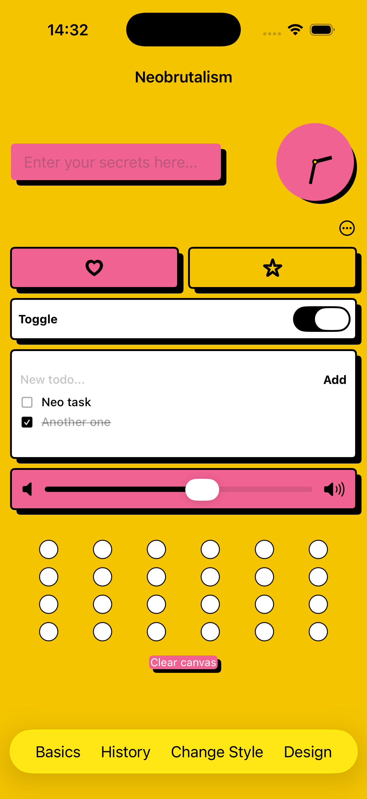
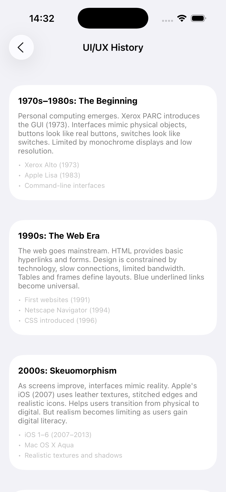
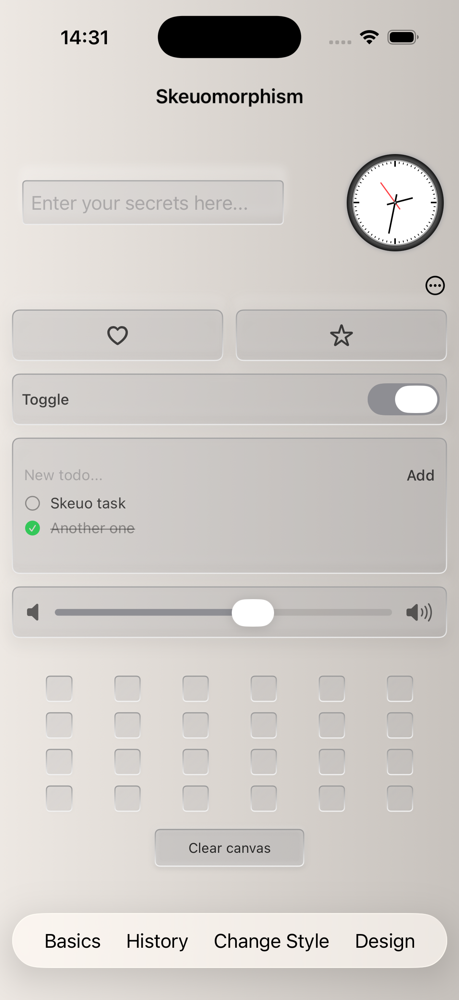

# DesignPedia

DesignPedia started as a SwiftUI exploration project to deepen my understanding of iOS UI architecture and prepare for working as an iOS engineer intern in a Design Systems team.

As I became more interested in UI and UX, the project evolved into a playground for exploring how different visual design languages can be implemented as reusable interface systems in SwiftUI.

Instead of presenting styles as static references, DesignPedia applies them to the same interactive surfaces (typography, clocks, controls and widgets) making it possible to compare how different design paradigms behave through code.

The project became a way to explore several things at once:
- SwiftUI composition and reusable components  
- Design-system thinking and theming at an experimenting level and in the learning environment
- UI experimentation  


## Preview

<div align="center">
<table>
<tr>
<td align="center">

<br/>
Design Playground
</td>

<td align="center">

<br/>
History Reference
</td>

<td align="center">

<br/>
Skeuomorphic UI
</td>
</tr>
</table>

<p align="center">
  <a href="https://youtu.be/Emdzl1Ke7Vs">Watch Full Demo Video</a>
</p>

</div>


## Project Overview

The app is divided into three main areas:

**Design**:
A live playground where different visual systems are applied to the same set of interface components: typography, analog clock, controls, widgets, sliders and drawing surfaces. The design system can be switched at runtime while preserving the underlying structure.

**History**:
A contextual reference for each design language. It includes origin, influences, typical use cases and visual characteristics such as typography, color and surface treatment. This turns each style into a structured design-system entry rather than a visual theme.

**Basics**:
A set of educational screens covering design fundamentals such as typography, spacing, color theory, motion and UI evolution. Each section includes small code-based examples to connect theory with implementation.

## Architecture

DesignPedia is structured around separation of concerns between application flow, design systems, and feature modules.

```text
DesignPedia/
  App/
    DesignPediaApp.swift

  Core/
    Utils.swift

  DesignSystem/
    Components/
      StyleWidgetDemo.swift
    Styles/
      DesignStyle.swift
    Theme/
      ThemeEnvironment.swift

  Features/
    Basics/
    History/

  Basics/
    BasicsColorView.swift
    BasicsMotionView.swift
    BasicsSpacingView.swift
    BasicsTypographyView.swift
    CodeSnippetView.swift

  Styles/
    FlatDesign/
    Glassmorphism/
    Neobrutalism/
    Neumorphism/
    Skeuomorphism/

  Assets/
